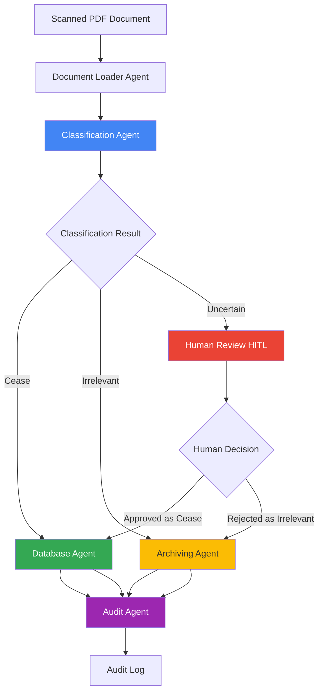
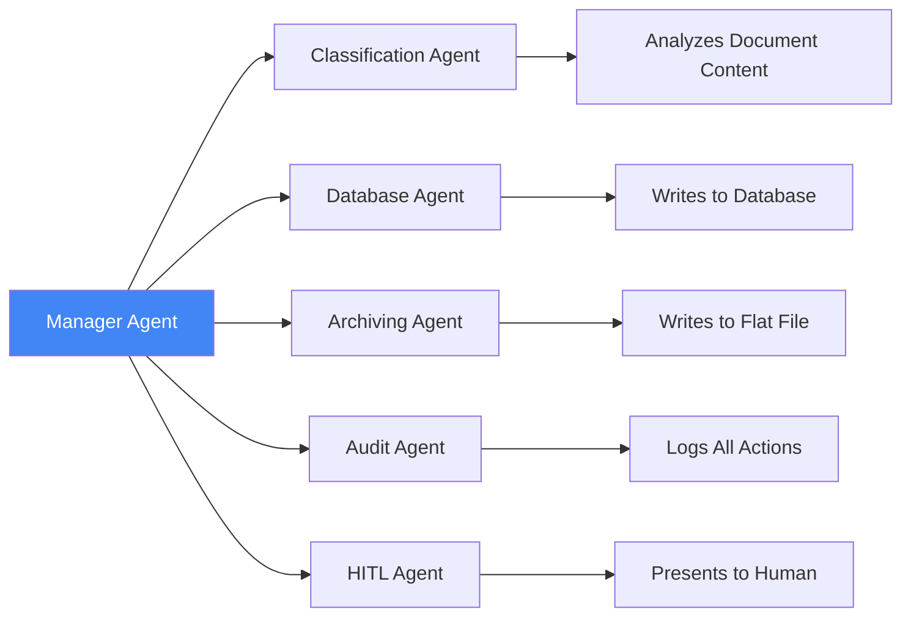

# Capstone Project: Cease & Desist Document Processing System

## 🎯 Project Overview

### Business Problem

Enterprises receive **Cease & Desist** requests from customers who want to stop all direct communication. Currently, human agents must manually read scanned PDF documents to determine if each request is legitimate, which is:
- ⏱️ Time-consuming and slow
- 💰 Expensive (requires human review)
- ❌ Error-prone (human fatigue, inconsistency)
- 📈 Not scalable (volume increases over time)

### Your Mission

Build an **intelligent multi-agent system** that automates the classification and processing of Cease & Desist documents, reducing manual effort while maintaining accuracy and compliance.

---

## 📋 Solution Requirements

### Core Functionality

Your system must:

1. **Classify Documents** into 3 categories:
   - ✅ **"Cease"** - Valid cease & desist request
   - ⚠️ **"Uncertain"** - Requires manual review
   - ❌ **"Irrelevant"** - Not a cease request

2. **Process Based on Classification:**
   - **Cease Requests** → Call database agent to store:
     - Date of document received
     - Document name
     - Extracted details
   
   - **Irrelevant Documents** → Call archiving agent to write to flat file:
     - Date of document received
     - Document name
   
   - **Uncertain Cases** → Present to human agent for review (HITL)

3. **Audit Everything:**
   - Log all requests with explanations
   - Track classification decisions
   - Maintain compliance trail

4. **Optional Enhancement:**
   - Support multiple languages

### Expected Coverage

Your implementation must demonstrate:
- ✅ **Multiple Agents** - Specialized agents for different tasks
- ✅ **Human-in-the-Loop (HITL)** - Manual review workflow
- ✅ **Database Interaction** - Store and retrieve data
- ✅ **Auditing** - Complete audit trail

---

## 🏗️ System Architecture

### High-Level Flow

### Agent Responsibilities

